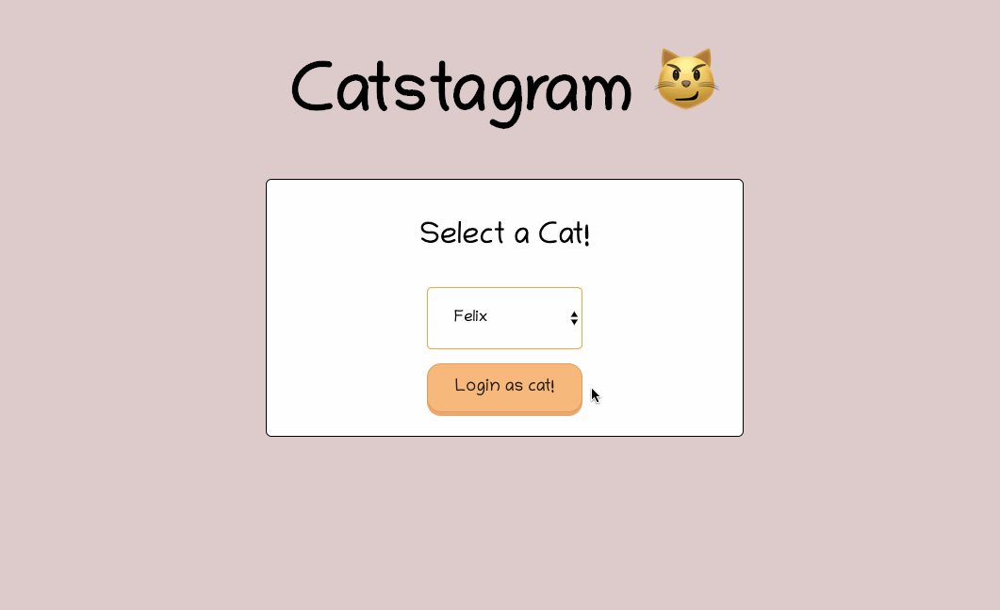
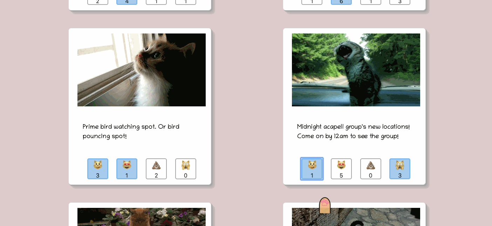
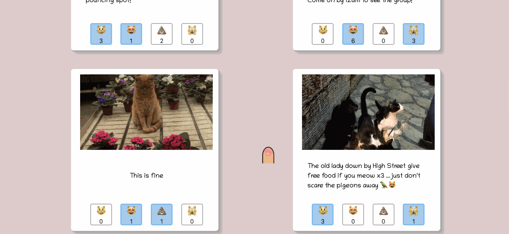
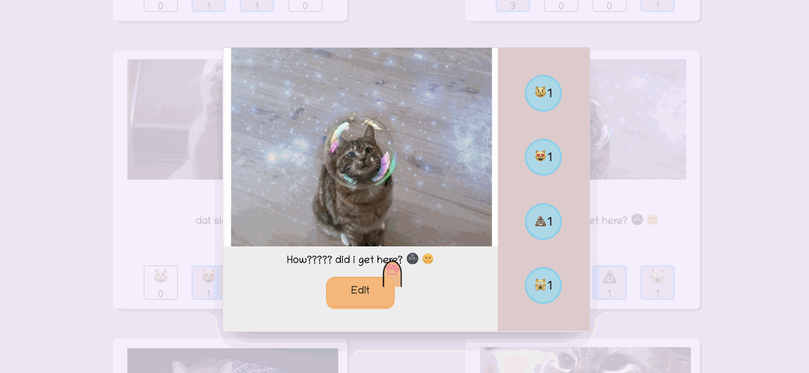

<h1 align="center">Catstagram 😸 📸 </h1>

  A <code>Javascript</code> web app designed as an Instagram clone but for cats. Local cats can post location tips and ticks for other cats to see.

  Built with ❤︎ by
  <a href="https://github.com/janetmndz">Janet Mendez</a> and
  <a href="https://github.com/cjl248"> Chris Liendo</a>
  

 

## Tech Stack
This web app makes use of the following:

**Backend**
- Ruby [2.6.1]
- Rails [~> 5.2.3] - MVC web framework used as an API
- PostgreSQL [>= 0.18, < 2.0] - Database

**Front End**
- HTML5
- Javscript [ES6]
- Custom CSS3 styling 

## Prerequisites
Before you begin, ensure you have installed the latest version of:

- [**Ruby**](https://www.ruby-lang.org/en/)
- [**Rails**](https://rubyonrails.org/)
- [**PostgreSQL**](https://www.postgresql.org/)

## Installing

- Clone this repo to your local machine `git clone <this-repo-url>`

**Backend Installation:**

- run `cd catstagram-backend` to acess backend
- run `bundle install` to install requiered dependencies
- Ensure you have PostgreSQL running
- run `rails db:create` to create a database locally.
- run `rails db:migrate` to create tables into the database.
- run `rails db:seed` to create seed data.
- run `rails s` to run the server. 

**Frontend Installation**
- run `cd catstagram-frontend` to acess frontend
- Ensure *Catstagram Backend* is running locally on `http://localhost:3000/`
- run `open index.html`
## Features

Cats can login as their prefer cat to gain acess to the Catstagram's homepage. Upon login, a greeting banner will appear.

Cats can add reactions to different locations that appear on their feed. Cats can only give one type of reaction per location - reaction will be deleted if clicked again.

Cats also have the option to view photos in a larger view upon clicking on the photo. 

Cats also have the option to edit posts that they have created in the module.

